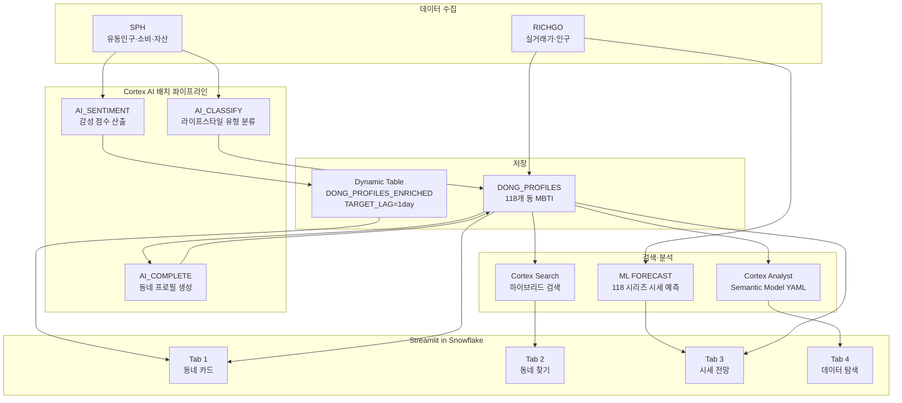

# 🏘️ 동네 MBTI

> **AI가 분석한 동네 성격으로 "나에게 맞는 동네"를 찾는 서비스**

[](https://www.snowflake.com)
[](https://streamlit.io)
[](https://python.org)

**[→ 앱 바로 가기](#)** · **[→ 데모 영상](#)**

---

## 왜 만들었나

이사를 결정할 때 가격, 교통, 학군은 쉽게 찾을 수 있습니다.  
그런데 **"이 동네가 나와 맞는가"** 는 어디서도 알려주지 않습니다.

| 서비스 | 무엇을 알 수 있나 | 빠진 것 |
|--------|-----------------|---------|
| 직방·다방 | 매물 가격, 면적 | 동네 분위기·성격 |
| 호갱노노 | 실거래가 시세 흐름 | 라이프스타일 적합성 |
| 카카오맵 | 주변 시설 위치 | 데이터 기반 동네 정의 |

매년 약 **43만 명**이 타 지역에서 서울로 이사 옵니다. 서울 내 이동까지 합치면 연간 **122만 건**의 주거 이동이 발생합니다.  
이 중 **79.8%가 1인 이동**, 전입자의 **68.8%가 20-30대 청년**입니다.

[한국리서치 조사(2024.11)](https://hrcopinion.co.kr/archives/31837)에 따르면 **78%**가 주거지 선택 시 '동네 분위기·생활환경'을 중요하게 보지만,  
기존 부동산 플랫폼은 가격·면적 정보만 제공합니다. ([한국소비자원 2018](https://www.kca.go.kr): 앱 정보-실제 일치율 **41%**)

동네 MBTI는 Snowflake Marketplace 데이터(상권·부동산·유동인구·소비)를 교차 분석하여  
서울 3구 118개 동의 성격을 MBTI 16유형으로 정의합니다.

> **출처**: [통계청 국내인구이동통계 2024](https://kostat.go.kr/board.es?mid=a10301010000&bid=205&list_no=434904) · [서울정책컨벤션 인구이동 분석](https://scpm.seoul.go.kr/seoul-policy/evt0236) · [서울연구원 도시모니터링](https://data.si.re.kr/smr2024/smr2024_01population.html)

---

## 이런 분들을 위해 만들었어요

**"직방에서 가격은 봤는데, 이 동네 분위기가 나랑 맞는지 모르겠어요"**  
→ Tab 1에서 동네 MBTI를 확인하고, 내 성격과 잘 맞는 동네를 찾아보세요.

**"학군 좋고 조용한 동네를 찾고 싶은데 일일이 검색하기 너무 힘들어요"**  
→ Tab 2에서 "초등학교 근처 조용한 서초구 동네 추천해줘"처럼 자연어로 물어보세요.

**"전세 계약이 만료되는데 지금 이사 타이밍인지 더 기다려야 하는지 모르겠어요"**  
→ Tab 3에서 실거래가 데이터 기반 향후 3개월 시세 전망을 확인하세요.

**"서초구에서 T 성향이 가장 강한 동네 순위가 궁금해요"**  
→ Tab 4에서 자연어로 물어보면 SQL로 변환해 정확한 수치를 뽑아줍니다.

---

## 핵심 기능

### Tab 1 — 동네 MBTI 카드

서울 3구 118개 동을 4축 데이터로 분석해 MBTI 16유형 중 하나로 분류합니다.

| 축 | 의미 | 데이터 |
|----|------|--------|
| E / I | 활발한 동네 vs 조용한 동네 | 유동인구, 주말 활성도 |
| S / N | 실용적 동네 vs 문화적 동네 | 상권 업종 분포 |
| T / F | 경제 중심 vs 생활 중심 | 자산 수준, 소비 패턴 |
| J / P | 안정적 동네 vs 변화하는 동네 | 시세 변동성, 인구이동 |

동네 카드에서 MBTI 유형 + 성격 요약 + 다른 동네와의 궁합 점수를 확인할 수 있습니다.

> **예시** — 서초구 반포동은 `INTJ`  
> "조용하고 계획적인 분위기. 고자산 1인 가구와 전문직 비율이 높고, 주말보다 평일 활동이 활발한 안정적인 동네."  
> 궁합: 잠원동(INTJ) ★★★★★ · 방배동(ISTJ) ★★★★☆ · 당산동(ENFP) ★★☆☆☆

### Tab 2 — 자연어 동네 찾기

"지하철 2호선 근처에서 조용하고 카페 많은 동네 알려줘"처럼 자연어로 대화하면  
Cortex Search + Cortex Analyst가 조건에 맞는 동네를 추천해줍니다.  
멀티턴 대화를 지원하여 조건을 좁혀가며 탐색할 수 있습니다.

> **대화 예시**
> ```
> 나  : 조용하고 학군 좋은 서초구 동네 추천해줘
> AI  : 반포동(INTJ), 잠원동(INTJ), 서초동(ISTJ)이 적합해요.
>       셋 다 학원가 밀집·낮은 유동인구·안정적 시세가 특징입니다.
> 나  : 전세 2억대로 가능한 곳만 알려줘
> AI  : 조건에 맞는 동네는 방배동입니다. 최근 6개월 전세 중위가 1.9억이에요.
> ```

### Tab 3 — 이사 예보

5년치 실거래가 시계열 데이터를 기반으로 향후 3개월 시세를 예측합니다.  
"지금 이사하면 좋을까?"에 대한 AI 판단을 계절성·인구이동·시세 추이로 제공합니다.

### Tab 4 — 데이터 탐색 (Cortex Analyst)

Tab 2가 "느낌으로 동네 찾기"라면, Tab 4는 **수치로 파고드는 분석 도구**입니다.  
자연어 질문을 SQL로 자동 변환(NL2SQL)하여 MBTI 점수·통계·순위를 정확하게 조회합니다.

> **질의 예시**
> - "서초구에서 가장 외향적인(E) 동네 TOP 3 알려줘"
> - "16개 MBTI 유형 분포가 어떻게 돼?"
> - "각 구별 평균 TF 점수 비교해줘"

Tab 2(Cortex Search)와 Tab 4(Cortex Analyst)의 차이:

| | Tab 2 | Tab 4 |
|-|-------|-------|
| 방식 | 벡터 + 키워드 하이브리드 검색 | 자연어 → SQL 자동 변환 |
| 적합한 질의 | "조용하고 카페 많은 동네" | "EI 점수 상위 3개 동" |
| 결과 형식 | 동네 프로필 카드 | 테이블·수치 |

---

## 왜 MBTI인가 — 설계 의사결정

### 1. MBTI를 프레임으로 선택한 이유

"동네 성격을 숫자로 표현하면 해석이 어렵다."  
클러스터링(K-means)은 '1번 군집·2번 군집' 같은 레이블을 만들어내는데,  
사람들이 이미 알고 있는 언어인 **MBTI 16유형**을 쓰면 "반포동은 INTJ" 한 마디로 전달됩니다.

한국 18-35세의 **93%**가 MBTI 검사 경험이 있고, Google Trends 기준 MBTI 검색량은 **세계 1위**(2위 홍콩의 약 6배)입니다.  
[Rentfrow et al. (2013)](https://doi.org/10.1037/a0034434)은 150만 명 데이터로 미국을 3개 성격 지역으로 분류했고,  
[Jokela et al. (2015, PNAS)](https://doi.org/10.1073/pnas.1415800112)은 런던 216개 구역에서 Person-Environment Fit이 삶의 만족도에 영향을 미침을 실증했습니다.  
동네 MBTI는 이 학술적 기반 위에 한국인이 가장 익숙한 MBTI 프레임을 적용한 응용 구현입니다.

### 2. 4축을 어떻게 데이터로 정의했나

핵심 원칙: **"사람의 MBTI가 아닌 동네의 MBTI"** — 같은 축이라도 측정 대상이 다릅니다.

| 축 | 해석 | 핵심 지표 | 근거 |
|----|------|----------|------|
| **E / I** | 활발한 동네 vs 조용한 동네 | 외부 방문자 비율, 주말 유동인구 비율, 유흥/여가 소비 비율 | 외부인이 많이 오고 주말에 활성화될수록 외향적(E) |
| **S / N** | 실용적 동네 vs 문화적 동네 | 음식·의료·학원 소비 비율(S↑) vs 카페·문화·스포츠 소비 비율(N↑) | 생활 밀착형 소비가 높을수록 감각(S), 문화 소비가 높을수록 직관(N) |
| **T / F** | 경제력 중심 동네 vs 생활감 동네 | 평균 소득, 평균 자산, 평균 매매가 | 고자산·고시세 동네일수록 논리/경제(T), 반대일수록 감정/생활(F) |
| **J / P** | 안정적 동네 vs 변화하는 동네 | 시세 변동계수(CV), 20·30대 인구 비율 | 시세가 출렁이고 젊은 층이 많을수록 유동적(P), 안정적이면 계획적(J) |

### 3. 기준점(0)을 어떻게 잡았나

각 피처를 **z-score로 정규화** (평균 0, 표준편차 1) 한 뒤, 3개 피처의 z-score 평균으로 축 점수를 계산합니다.

```
ei_score = (z_방문자비율 + z_주말유동 + z_여가소비) / 3
→ 118개 동 전체 평균보다 활발하면 E, 조용하면 I
```

절대적 기준이 아닌 **상대적 비교** — "서울 3구 118개 동 중 어디에 위치하는가"가 기준입니다.

### 4. 검증 결과

| 항목 | 목표 | 결과 |
|------|------|------|
| 분석 대상 동 수 | 50개 이상 | **118개** |
| 4축 데이터 공백 | 10% 미만 | **0%** |
| MBTI 유형 다양성 | 3종 이상 | **16종 전부** |

16종이 전부 나온다는 것은 억지로 레이블을 붙인 게 아니라  
데이터가 자연스럽게 동네마다 다른 성격을 만들어냈다는 의미입니다.

---

## 분석 범위

**서울 3구 118개 동** — 서초구·영등포구·중구

동네 성격을 정밀하게 정의하려면 **동(洞) 단위** 데이터가 필요합니다.  
Snowflake Marketplace에서 SPH + RICHGO가 이 3개 구를 동 단위로 완전히 커버하기 때문에,  
서울 25구 전체를 얕게 다루는 대신 **3구를 깊게 파는 전략**을 선택했습니다.

덕분에 "서초구"가 아닌 "반포동 vs 잠원동"을 구분하는 수준의 분석이 가능합니다.

---

## 데이터

| 소스 | 무엇을 알 수 있나 |
|------|-----------------|
| **SPH** (SKT 유동인구 + KCB 자산/소득 + 신한카드 소비) | 동별 활동성, 소비 업종, 자산 수준 |
| **RICHGO** | 매매·전세 실거래가 이력, 인구이동 추정 |

모두 **Snowflake Marketplace**를 통해 연동 — 외부 크롤링·API 없음.  
데이터 기준: 2021~2026년 | Dynamic Table로 **1일 주기** 자동 갱신.

> **탐색했으나 미채택**: 아정당(Telecom) 데이터는 구(區) 단위만 제공하여  
> 동(洞) 단위 분석에 JOIN이 불가해 최종 파이프라인에서 제외했습니다.

---

## 기술 스택

**Platform**: Snowflake (Streamlit in Snowflake)  
**Language**: Python  
**AI**: Snowflake Cortex AI

| Cortex 기능 | 사용 위치 |
|------------|---------|
| AI_CLASSIFY | 동네 상권 업종 → 라이프스타일 유형 분류 (Tab 1 전처리) |
| AI_COMPLETE | 동네 프로필 텍스트 생성, 이사 전망 해설 (Tab 1·3) |
| CORTEX.SENTIMENT | 동네 프로필 감성 점수 산출 (Dynamic Table 파이프라인) |
| Cortex Search | 동네 프로필 하이브리드(벡터+키워드) 검색 (Tab 2) — 단순 벡터 대비 [검색 품질 12%+ 향상](https://docs.snowflake.com/en/user-guide/snowflake-cortex/cortex-search/cortex-search-overview) |
| Cortex Analyst | 자연어 → SQL 변환, Semantic Model 기반 (Tab 4) — [90%+ 정확도](https://www.snowflake.com/en/engineering-blog/cortex-analyst-text-to-sql-accuracy-bi/) |
| Cortex Agent | DDL 설계 완료 — Trial 계정 제약으로 런타임 미호출, 정식 계정 시 즉시 활성화 |
| ML FORECAST | 실거래가 시계열 예측 (Tab 3) |

---

## 아키텍처



---

## 스크린샷

> *(배포 완료 후 탭별 스크린샷 추가 예정)*

---

## 팀

Snowflake Hackathon 2026 Korea | Tech Track | 2인 팀  
개발 기간: 2026년 4월 1일 ~ 4월 12일
