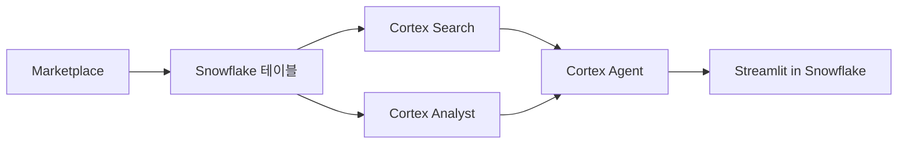

# 🏘️ dongne-mbti

**동네 MBTI — AI로 읽는 동네 성격과 이사 타이밍**

> Snowflake Hackathon 2026 Korea | Tech Track | 개발: 4/1~4/12

## 프로젝트 개요

이사를 고민하는 사람이 동네의 '성격'을 MBTI로 직관적으로 이해하고, 자연어로 맞춤 동네를 찾고, 이사 타이밍까지 판단할 수 있는 AI 기반 서비스.

**분석 범위**: 서울 핵심 3구(서초·영등포·중) ~55개 동 단위 딥다이브
> SPH + RICHGO Marketplace 데이터가 3개 구를 풀커버하여, 25구 전체 대신 3구 동 단위로 피봇. 유동인구·자산·소비·시세·인구이동 데이터를 동 단위로 교차 분석하여 더 정밀한 MBTI 산출.

## 핵심 기능

| 탭 | 기능 | Cortex AI |
|----|------|-----------|
| 동네 MBTI 카드 | E/I·S/N·T/F·J/P 4축으로 동네 성격 분류 + 비교 + 궁합 | Classify, Sentiment, Complete |
| 자연어 동네 찾기 | 대화형 UX로 조건에 맞는 동네 추천 | Agent (Search + Analyst) |
| 이사 예보 | 실거래가 기반 3개월 시세 전망 + 이사 타이밍 판단 | Complete, Analyst |

## 기술 스택

- **Platform**: Snowflake (Cortex AI 풀스택)
- **Frontend**: Streamlit in Snowflake
- **Data**: Snowflake Marketplace — SPH(SKT 유동인구·KCB 자산/소득·신한카드 소비, 3구 풀데이터) + RICHGO(실거래 시세·인구이동 추정) + Telecom(이사 추정 데이터)
- **Language**: Python

## 아키텍처

## 문서

- [해커톤 규칙](docs/hackathon-rules.md) - 일정, 심사 기준, 제출 요건
- [프로젝트 기획서](docs/project-plan.md) - 배경, 핵심 기능, 아키텍처, 일정
- [데이터 소스](docs/data-sources.md) - Marketplace 데이터 및 Cortex AI 매핑
- [질의 예시](docs/query-examples.md) - Cortex Agent 자연어 질의 22개
