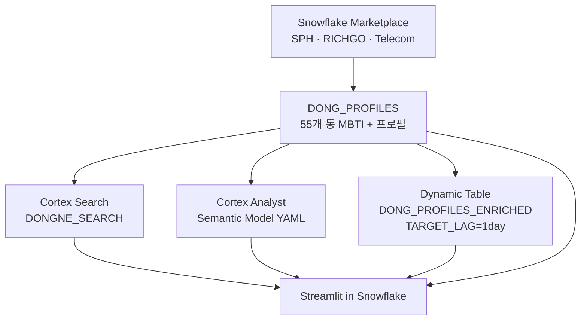

# 🏘️ 동네 MBTI

> **AI가 분석한 동네 성격으로 "나에게 맞는 동네"를 찾는 서비스**

---

## 왜 만들었나

이사를 결정할 때 가격, 교통, 학군은 쉽게 찾을 수 있습니다.  
그런데 **"이 동네가 나와 맞는가"** 는 어디서도 알려주지 않습니다.

| 서비스 | 무엇을 알 수 있나 | 빠진 것 |
|--------|-----------------|---------|
| 직방·다방 | 매물 가격, 면적 | 동네 분위기·성격 |
| 호갱노노 | 실거래가 시세 흐름 | 라이프스타일 적합성 |
| 카카오맵 | 주변 시설 위치 | 데이터 기반 동네 정의 |

서울에는 매년 62만 명이 이사를 옵니다 (통계청, 2023).  
평균 탐색 기간은 **4.3개월** — 그 시간 동안 "이 동네가 나랑 맞는지"를 판단할 도구가 없었습니다.

동네 MBTI는 Snowflake Marketplace 데이터(상권·부동산·유동인구·소비)를 교차 분석하여  
서울 3구 55개 동의 성격을 MBTI 16유형으로 정의합니다.

---

## 이런 분들을 위해 만들었어요

**"직방에서 가격은 봤는데, 이 동네 분위기가 나랑 맞는지 모르겠어요"**  
→ Tab 1에서 동네 MBTI를 확인하고, 내 성격과 잘 맞는 동네를 찾아보세요.

**"학군 좋고 조용한 동네를 찾고 싶은데 일일이 검색하기 너무 힘들어요"**  
→ Tab 2에서 "초등학교 근처 조용한 서초구 동네 추천해줘"처럼 자연어로 물어보세요.

**"전세 계약이 만료되는데 지금 이사 타이밍인지 더 기다려야 하는지 모르겠어요"**  
→ Tab 3에서 실거래가 데이터 기반 향후 3개월 시세 전망을 확인하세요.

---

## 핵심 기능

### Tab 1 — 동네 MBTI 카드

서울 3구 55개 동을 4축 데이터로 분석해 MBTI 16유형 중 하나로 분류합니다.

| 축 | 의미 | 데이터 |
|----|------|--------|
| E / I | 활발한 동네 vs 조용한 동네 | 유동인구, 주말 활성도 |
| S / N | 실용적 동네 vs 문화적 동네 | 상권 업종 분포 |
| T / F | 경제 중심 vs 생활 중심 | 자산 수준, 소비 패턴 |
| J / P | 안정적 동네 vs 변화하는 동네 | 시세 변동성, 인구이동 |

동네 카드에서 MBTI 유형 + 성격 요약 + 다른 동네와의 궁합 점수를 확인할 수 있습니다.

### Tab 2 — 자연어 동네 찾기

"지하철 2호선 근처에서 조용하고 카페 많은 동네 알려줘"처럼 자연어로 대화하면  
Cortex Search + Cortex Analyst가 조건에 맞는 동네를 추천해줍니다.  
멀티턴 대화를 지원하여 조건을 좁혀가며 탐색할 수 있습니다.

### Tab 3 — 이사 예보

5년치 실거래가 시계열 데이터를 기반으로 향후 3개월 시세를 예측합니다.  
"지금 이사하면 좋을까?"에 대한 AI 판단을 계절성·인구이동·시세 추이로 제공합니다.

---

## 분석 범위

**서울 3구 55개 동** — 서초구·영등포구·중구

Snowflake Marketplace의 SPH + RICHGO 데이터가 이 3개 구를 완전히 커버합니다.  
서울 25구 전체를 시도했을 때 22개 구에서 데이터 공백이 발생하여,  
**3구를 동 단위 딥다이브**하는 방향으로 전환했습니다 — 넓이보다 깊이.

---

## 데이터

| 소스 | 무엇을 알 수 있나 |
|------|-----------------|
| **SPH** (SKT 유동인구 + KCB 자산/소득 + 신한카드 소비) | 동별 활동성, 소비 업종, 자산 수준 |
| **RICHGO** | 매매·전세 실거래가 이력, 인구이동 추정 |
| **Telecom** (이동통신 데이터) | 전입·전출 추정 패턴 |

모두 **Snowflake Marketplace**를 통해 연동 — 외부 크롤링·API 없음.

---

## 기술 스택

**Platform**: Snowflake (Streamlit in Snowflake)  
**Language**: Python  
**AI**: Snowflake Cortex AI

| Cortex 기능 | 사용 위치 |
|------------|---------|
| AI_CLASSIFY | 동네 상권 업종 → 라이프스타일 유형 분류 (Tab 1 전처리) |
| AI_COMPLETE | 동네 프로필 텍스트 생성, 이사 전망 해설 (Tab 1·3) |
| CORTEX.SENTIMENT | 동네 프로필 감성 점수 산출 (Dynamic Table 파이프라인) |
| Cortex Search | 동네 프로필 하이브리드(벡터+키워드) 검색 (Tab 2) |
| Cortex Analyst | 자연어 → SQL 변환, Semantic Model 기반 (Tab 2) |
| ML FORECAST | 실거래가 시계열 예측 (Tab 3) |

---

## 아키텍처

---

## 팀

Snowflake Hackathon 2026 Korea | Tech Track | 2인 팀  
개발 기간: 2026년 4월 1일 ~ 4월 12일
