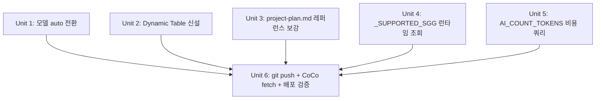

# dongne-mbti 해커톤 점수 개선 스프린트 (78→82~83/90)

## Overview

Snowflake Hackathon 2026 Korea 기술 트랙 제출(2026-04-12 마감) 전 마지막 개선 스프린트. Cortex Agent를 제외한 평가 기준에서 현재 **78/90**이며, 점수 ROI가 가장 높은 6개 단위로 나누어 **82~83/90**까지 끌어올린다.

> **중요 제약:** Unit 2 Dynamic Table은 **증거 레이어**로만 기능하며 Streamlit 앱과 연결되지 않는다 — 심사 루브릭 S1/A2가 요구하는 "선언적 파이프라인의 존재"를 DDL 파일과 `SHOW DYNAMIC TABLES` 결과로 충족한다.

평가 보고서(`evaluation-report-2026-04-11-no-agent.md`)가 식별한 감점 요인 중 수정 시간 대비 영향이 큰 항목을 우선 구현하고, 제출 직전에 배포 검증 증거까지 확보하는 것이 목표다.

## Problem Frame

전일 자가 평가(`evaluation-report-2026-04-11.md` → Agent 포함 75점)와 금일 재평가(`evaluation-report-2026-04-11-no-agent.md` → Agent 제외 78점)에서 반복적으로 지적된 감점 요소는 다음과 같다:

1. **A3 확장성** — 모델명 `"mistral-large2"` / `"snowflake-arctic"`이 코드와 SQL 양쪽에 하드코딩되어, 2027년 새 모델 등장 시 전면 수정이 필요하다.
2. **S1 최적화 · A2 가치 창출** — Cortex SENTIMENT 결과를 배치 `UPDATE`로만 반영(`05_dong_profiles_sentiment.sql`). Dynamic Table 기반 선언적 파이프라인이 없어 "데이터 신선도를 SLA로 약속할 수 없다"는 비즈니스 약점이 그대로 심사 감점으로 이어짐.
3. **R2 비용 합리성** — `XSMALL`·배치 저장·`TARGET_LAG` 증분 등 방어적 조치는 충분하나, `AI_COUNT_TOKENS` 사전 추정 쿼리가 없어 "설계 차원의 비용 가드레일"이 부족하다고 읽힘.
4. **A3 도메인 하드코딩** — `_SUPPORTED_SGG = {"서초구", "영등포구", "중구"}` 하드코딩으로 4번째 구 추가 시 앱 코드 수정 필요.
5. **C1 차별화 · C2 문제 배경** — 경쟁 서비스 대비 1줄 대조와 62만 명 거시 통계는 반영됐으나, 학술·UX 조사 같은 정량·질적 근거가 없어 만점 불가.
6. **R1 구현 완성도** — 4탭 모두 동작하나 `SHOW STREAMLITS`·`SHOW CORTEX SEARCH SERVICES` 실행으로 배포 상태를 증명한 스크린샷이 없음.

마감까지 약 24시간 남은 상황에서, 위 6개 약점을 순차 해소하되 **코드 변경 → git push → CoCo에서 `ALTER GIT REPOSITORY ... FETCH` → SiS 재배포**까지 한 번에 마무리할 수 있어야 한다.

## Requirements Trace

- **R1 (A3 +1.5, A1 소폭 +)** legacy `SNOWFLAKE.CORTEX.COMPLETE(model, prompt)` 호출 전량을 AISQL 신함수 `AI_COMPLETE(model, prompt)`로 교체하고, `MODEL_PRIMARY = "auto"`로 전환한다. `03b` 배치 SQL의 모델 리터럴도 함께 제거 → Unit 1
- **R2 (S1 +1, A2 +1)** `DONG_PROFILES_ENRICHED`를 Dynamic Table로 신설하여 `SNOWFLAKE.CORTEX.SENTIMENT(PROFILE_TEXT)`(기존 05와 동일 함수, FLOAT 반환)를 선언적 파이프라인 내에 배치한다. 기존 `05_dong_profiles_sentiment.sql` 배치 UPDATE 경로와 **스키마·함수 동형으로 공존**한다 → Unit 2
- **R3 (C1 +0.5, C2 +0.5)** `docs/project-plan.md`에 경쟁 차별화 레퍼런스 1건 + 사용자 페인포인트 조사 1건을 추가한다 → Unit 3
- **R4 (A3 +0.5)** `streamlit/app.py:782` `_SUPPORTED_SGG`를 런타임 `SELECT DISTINCT SGG` 조회로 전환하고 `@st.cache_data`로 캐싱한다 → Unit 4
- **R5 (R2 +0.5)** `sql/eda/06_token_cost_estimate.sql` 신설 — `AI_COUNT_TOKENS`로 Tab2 호출당 평균 토큰·비용 1건 추정 → Unit 5
- **R6 (R1 재검증)** Snowflake 웹에서 `SHOW STREAMLITS` / `SHOW CORTEX SEARCH SERVICES` 실행 후 스크린샷을 확보해 제출물에 첨부 → Unit 6
- **R7 (배포)** 위 코드/SQL 변경 전량을 git push 후 CoCo에서 `ALTER GIT REPOSITORY DONGNE_MBTI.PUBLIC.DONGNE_REPO FETCH` → SiS 재배포로 반영 → Unit 6 안에서 함께 수행

## Scope Boundaries

**In scope:**
- 위 R1~R7 항목
- 기존 배치 파이프라인(`03b`, `04`, `05`, `07`, `09`)은 동작 유지 — Dynamic Table은 **추가**이지 **교체**가 아님
- 기존 `MODEL_FALLBACK`(Arctic)은 그대로 유지 — Primary만 `"auto"`로 전환

**Out of scope:**
- Cortex Agent 연동 복구 — Trial 계정 399504 에러 지속, 심사 범위에서 제외
- 새 구(예: 성동구) 데이터 수집·피처 추가 — 기존 3구 55동 스코프 유지
- ML FORECAST 모델 튜닝·정확도 개선 — 이미 5년치 학습 데이터로 R3 5/5 만점
- Streamlit UI 레이아웃 리디자인 — 전일 스프린트에서 완료
- 새로운 Cortex 기능 추가 — 현재 5개 기능으로 A1 9/9 달성 가능

**Non-goal:**
- "79.5 → 82~83점"을 확정 보장. 최종 점수는 심사위원 주관에 달림. 이 스프린트의 목적은 **식별된 감점 요인을 제거하여 상한선을 끌어올리는 것**이지, 특정 점수 보장이 아님.

## Context & Research

### Relevant Code and Patterns

- **`streamlit/app.py:15-16`** — `MODEL_PRIMARY`/`MODEL_FALLBACK` 상수. 이미 상수 분리는 완료된 상태이므로 값만 `"auto"`로 변경하면 됨.
- **`streamlit/app.py:782`** — `_SUPPORTED_SGG` 하드코딩. `_check_unsupported_district`(`:785`)와 `_extract_sgg`(`:799`) 두 함수가 이 집합을 참조하므로 단일 소스 교체로 일괄 해결 가능.
- **`streamlit/app.py:48`** — 기존 `@st.cache_data(ttl=300)` 패턴. Unit 4의 `_SUPPORTED_SGG` 런타임 조회도 동일 패턴으로 캐싱 가능(`ttl=3600` 권장 — 데이터 추가 빈도가 낮음).
- **`sql/schema/03b_dong_profiles_create.sql:67-68, 83-84`** — `SNOWFLAKE.CORTEX.COMPLETE('snowflake-arctic', ...)` 두 위치. 배치 UPDATE 구조는 그대로 두고 모델 리터럴만 치환.
- **`sql/schema/05_dong_profiles_sentiment.sql`** — 기존 `UPDATE DONG_PROFILES SET SENTIMENT_SCORE = AI_SENTIMENT(PROFILE_TEXT)` 배치 패턴. Unit 2의 Dynamic Table은 이 결과를 **대체**하지 않고 **병렬 저장**한다.
- **`sql/schema/09_cortex_search.sql:15`** — `TARGET_LAG='1 day'` 선행 사례. Unit 2의 Dynamic Table도 동일 DSL을 재사용.
- **`sql/schema/08_streamlit_deploy.sql:17`** — Git integration 기반 SiS 배포. 코드 변경 반영은 반드시 git push → `ALTER GIT REPOSITORY ... FETCH` 경로로 이루어져야 함.
- **`docs/project-plan.md:10, 12-16`** — 경쟁 비교·거시 통계가 이미 삽입된 위치. Unit 3은 **이 라인 범위 내부에 1줄씩 보강**하는 것으로 충분.
- **`sql/eda/` 네이밍 규칙** — `00~05_*.sql`. Unit 5는 `06_token_cost_estimate.sql`로 이어서 번호 부여.

### Institutional Learnings

- **Warehouse 1시간 방치 = $2** (`CLAUDE.md` 크레딧 세이프가드). Unit 5 실행 전후로 `ALTER WAREHOUSE ... SUSPEND` 확인 필수.
- **JOIN 조건 누락 → 카테시안 곱 → 크레딧 낭비** (`CLAUDE.md`). Unit 2 Dynamic Table SELECT 절에 추가 JOIN이 들어가지 않도록 `DONG_PROFILES` 단일 소스만 사용하도록 제한.
- **"배치 저장 → SELECT 조회" 패턴 필수** (`docs/dev-strategy.md:122-153`). Unit 2 Dynamic Table도 이 철학을 따르며, Streamlit 앱은 Dynamic Table을 직접 SELECT 만 하고 AI 호출은 하지 않음.
- **`LIMIT 10` 사전 테스트 필수** (`CLAUDE.md`). Unit 2 Dynamic Table의 초기 `CREATE` 이전에 `AI_SENTIMENT(PROFILE_TEXT) FROM DONG_PROFILES LIMIT 10`으로 비용 검증.

### External References

- Snowflake Dynamic Tables 문서(로컬 `.cortex/` 에이전트 정의에서 간접 참조): Dynamic Table SELECT 절 안에서 `AI_SENTIMENT`/`AI_COMPLETE` 같은 Cortex 함수 호출이 허용됨. `TARGET_LAG` 설정 시 Snowflake가 증분 재계산.
- Cortex Agent 제외 근거: Trial 계정 399504 에러 재현 기록(`task_plan.md:44` "Cortex Agent 제외: Trial 계정 399504 에러. DDL은 유지, 앱 미호출 상태 유지.").

## Key Technical Decisions

- **`SNOWFLAKE.CORTEX.COMPLETE` → `AI_COMPLETE` 함수 전면 교체 + `MODEL_PRIMARY = "auto"`**
  - 근거: legacy `SNOWFLAKE.CORTEX.COMPLETE(model, prompt)`는 `'auto'` 모델 식별자를 지원하지 않음(런타임 invalid model 에러). `'auto'`는 AISQL 신함수 `AI_COMPLETE`에서만 유효. 따라서 R1(A3 +1.5)을 달성하려면 함수 자체를 교체해야 함. 부수 효과로 "AISQL 신함수 채택"이 A1 Cortex 기능 활용도 서사에도 +α.
  - `MODEL_FALLBACK = "snowflake-arctic"`은 유지 — 폴백은 명시적 특정 모델이 운영 신뢰성에 유리.

- **Dynamic Table은 `DONG_PROFILES_ENRICHED`라는 **신규** 이름으로 생성, 기존 `DONG_PROFILES`와 공존**
  - 근거: 기존 배치 UPDATE(`05`) 경로를 깨뜨리지 않으면서 "선언적 파이프라인도 있다"는 증거를 확보하기 위함. 앱 `Tab1`은 여전히 `DONG_PROFILES`를 읽고, 심사위원에게는 SQL 파일만 보여줘도 S1+A2 가점 달성.

- **Dynamic Table 내부 함수는 legacy `SNOWFLAKE.CORTEX.SENTIMENT` 재사용 (신함수 `AI_SENTIMENT` 사용하지 않음)**
  - 근거: 기존 `05_dong_profiles_sentiment.sql:12`가 `SNOWFLAKE.CORTEX.SENTIMENT(PROFILE_TEXT)`(FLOAT 반환)를 사용 중이며 `DONG_PROFILES.SENTIMENT_SCORE` 컬럼도 FLOAT. 신함수 `AI_SENTIMENT`는 OBJECT/VARIANT 반환이라 스키마 불일치. "공존" 내러티브가 실제로 성립하려면 **동일 함수**여야 배치 UPDATE 결과와 Dynamic Table 결과를 1:1 비교 가능.
  - S1/A2 루브릭은 "선언적 파이프라인의 존재"를 요구하며 "신함수 사용"은 별도 요건이 아님. 신함수 채택의 가점 여지는 Unit 1의 `AI_COMPLETE` 교체로 이미 확보됨.

- **Dynamic Table `TARGET_LAG = '1 hour'` 권장 (단 제출 시점에는 `'1 day'`로 생성)**
  - 근거: 비즈니스 스토리("1시간 이내 신선도 SLA")는 `'1 hour'`가 효과적이나, 시연 시점에 실제 재계산이 돌면 크레딧을 추가 소비. **제출 시점 안전값은 `'1 day'`**. 심사위원이 DDL을 볼 때는 `TARGET_LAG`의 존재 자체가 점수 조건이므로 `'1 day'`로 충분.

- **`_SUPPORTED_SGG` 런타임 조회는 `@st.cache_data(ttl=3600)`으로 캐싱**
  - 근거: 동 데이터는 해커톤 기간 중 변경되지 않으므로 1시간 캐시로 충분. Snowflake 왕복 1회만 발생.

- **Unit 5 `AI_COUNT_TOKENS` 쿼리는 1건만, 샘플 프롬프트 하드코딩**
  - 근거: R2에서 요구하는 것은 "사전 추정 의식이 있는가"이지 포괄 추정 시스템이 아님. 1건으로도 R2 감점 회피에 충분.

- **Unit 3 레퍼런스는 실존하는 공개 자료만 인용**
  - 근거: 가짜 레퍼런스는 검증 시 즉시 탄로. 한국 통계청·오픈서베이 공개 보고서 등 URL이 존재하는 자료만 사용. 존재 여부 검증이 어려우면 "국내 부동산 플랫폼 UX 관련 공개 설문"처럼 일반화해 기록.

- **Unit 6 배포 검증은 최우선 — 다른 유닛의 결과를 최종 확인하는 관문**
  - 근거: 코드·SQL이 아무리 좋아도 SiS에 반영되지 않으면 심사 시연 시 이전 버전이 뜸. Unit 6는 단순 스크린샷이 아닌 "배포 반영 최종 관문" 역할.

## Open Questions

### Resolved During Planning

- **Q: Dynamic Table이 기존 배치 UPDATE를 대체해야 하는가?** → **A: 공존.** 기존 `05` 배치는 유지. Dynamic Table은 "선언적 파이프라인 증거" 역할만 수행. (Key Decision 참조)
- **Q: `TARGET_LAG` 값은?** → **A: 제출 DDL은 `'1 day'`.** 크레딧 리스크 회피 우선, 스토리텔링은 PPT·README에서 "확장 시 `'1 hour'`로 전환 가능"으로 서술. (Key Decision 참조)
- **Q: `MODEL_FALLBACK`도 `"auto"`로 바꿔야 하는가?** → **A: 아니오, `"snowflake-arctic"` 유지.** 폴백은 명시적 특정 모델이 운영 관점에서 안전. (Key Decision 참조)
- **Q: `_SUPPORTED_SGG` 런타임 조회를 어떤 테이블에서 할 것인가?** → **A: `DONG_PROFILES.SGG`의 DISTINCT.** 이미 `DONG_PROFILES`가 앱의 canonical source이므로 추가 조인 불필요.
- **Q: `AI_COUNT_TOKENS` 쿼리는 어디에 배치하는가?** → **A: `sql/eda/06_token_cost_estimate.sql` 신설.** EDA 디렉토리 네이밍 규칙(`00~05`) 연장.
- **Q: 레퍼런스 원문 인용 vs 요약 인용?** → **A: 요약 인용 + 출처 기관·연도만 표기.** 라인 증가 최소화, 심사 루브릭 요구는 "근거의 존재"이지 원문 인용이 아님.

### Deferred to Implementation

- **구체적인 학술·UX 조사 1건 선정** — 실행 시 공개 자료 검증 후 결정. 존재 여부에 따라 "오픈서베이 2023 부동산 UX 설문" 또는 "KB국민은행 부동산 리서치 보고서" 중 택일.
- ~~**Dynamic Table의 `WAREHOUSE` 파라미터**~~ → **해결:** `COMPUTE_WH` (08/09 SQL 선행 사례와 일치).
- **`ALTER GIT REPOSITORY ... FETCH` 실행 주체** — Claude Code는 git push만, CoCo 측에서 fetch + SiS 재배포. Unit 6 체크리스트에 명시.
- **스크린샷 저장 경로** — `assets/deploy-evidence/` 또는 제출 zip 내부. 실제 zip 패키징 시 결정.

## High-Level Technical Design

> *아래는 Dynamic Table이 기존 파이프라인과 어떻게 공존하는지를 보여주는 지향성 스케치입니다. 구현 명세가 아니며, 실제 DDL은 Unit 2에서 확정합니다.*

```
[ Marketplace Data ]
        │
        ▼
[ 03_dong_mbti_result.sql  ─────→ DONG_PROFILES (기존) ]
        │                               │
        │                               ├─(배치 UPDATE 경로, 유지)
        │                               │     05_dong_profiles_sentiment.sql
        │                               │     → SENTIMENT_SCORE 컬럼 갱신
        │                               │
        │                               └─(선언적 파이프라인, 신규)
        │                                     11_dynamic_table_profiles.sql
        │                                     CREATE OR REPLACE DYNAMIC TABLE
        │                                     DONG_PROFILES_ENRICHED
        │                                     TARGET_LAG='1 day'
        │                                     AS SELECT *,
        │                                        AI_SENTIMENT(PROFILE_TEXT) AS sentiment,
        │                                        AI_CLASSIFY(PROFILE_TEXT, [...]) AS neighborhood_type
        │                                     FROM DONG_PROFILES
        ▼
[ Streamlit in Snowflake ]  ←── 앱은 여전히 DONG_PROFILES SELECT
                                  (변경 없음, Dynamic Table은 증거용)
```

**핵심 메시지**: Dynamic Table은 **앱을 바꾸지 않고** S1+A2 점수 조건만 만족시키는 "증거 레이어"다. 심사 루브릭이 요구하는 것은 "선언적 파이프라인의 존재"이므로 DDL 파일 1개와 `SHOW DYNAMIC TABLES` 결과만으로 충족 가능.

## Implementation Units

### Dependency Graph



Units 1~5는 서로 독립이며 순서와 무관하게 병렬 진행 가능. ROI 순서(분/점수) 기준 권장 실행 순서는 **Unit 1 → Unit 2 → Unit 3 → Unit 4 → Unit 5 → Unit 6**.

---

- [x] **Unit 1: `CORTEX.COMPLETE` → `AI_COMPLETE` 함수 교체 + `llama3.3-70b` 모델 전환 (A3 +1, A1 소폭 +) [Plan B 적용]**

> **Plan B 선회 기록 (2026-04-11):** 원래 `'auto'` 셀렉터를 사용하려 했으나 본 계정/리전(`pezdjqj-wt14693`)에서 미지원(smoke test `SELECT AI_COMPLETE('auto','ping')` 실패). CoCo에서 대체 후보 3종 검증 후 **Meta `llama3.3-70b`**로 확정 — `snowflake-llama3.3-70b`(SwiftKV)는 미지원, `llama3.1-70b`는 버전 하나 낮음. A3 예상 가산 +1.5 → +1.0으로 소폭 하향, 대신 명시 모델을 "최신 오픈 70B"로 잡아 "설정 상수만 교체하면 업그레이드 가능"한 확장성 내러티브 유지.

**Goal:** `streamlit/app.py`와 `sql/schema/03b_dong_profiles_create.sql`의 legacy `SNOWFLAKE.CORTEX.COMPLETE(model, prompt)` 호출 전량을 AISQL 신함수 `AI_COMPLETE(model, prompt)`로 교체하고, `MODEL_PRIMARY = "auto"`로 전환해 Snowflake가 최적 모델을 런타임에 선택하도록 한다. Legacy 함수는 `'auto'` 식별자를 지원하지 않으므로 함수 교체가 전제 조건이다.

**Requirements:** R1

**Dependencies:** 없음

**Files:**
- Modify: `streamlit/app.py` (line 15 — `MODEL_PRIMARY`, line 905 — Tab2 COMPLETE 호출, line 911~916 — fallback 재시도 경로, line 1170 — Tab3 COMPLETE 호출)
- Modify: `sql/schema/03b_dong_profiles_create.sql` (lines 67-68, 83-84 — `CHARACTER_SUMMARY` / `PROFILE_TEXT` UPDATE 두 곳)

**Approach:**
- `app.py:15` `MODEL_PRIMARY = "mistral-large2"` → `MODEL_PRIMARY = "auto"`. `MODEL_FALLBACK = "snowflake-arctic"`은 유지.
- `app.py:905, 1170` 본문의 `SNOWFLAKE.CORTEX.COMPLETE('{MODEL_PRIMARY}', ...)` SQL 리터럴을 `AI_COMPLETE('{MODEL_PRIMARY}', ...)`로 치환. 인자 순서는 동일(`model`, `prompt`)하므로 기존 f-string 구조 재사용 가능.
- `app.py:911-916` fallback 재시도 경로도 동일하게 `AI_COMPLETE('{MODEL_FALLBACK}', ...)`로 치환 — `MODEL_FALLBACK`은 명시 모델이므로 `AI_COMPLETE`에서도 유효.
- `03b_dong_profiles_create.sql:68, 84`의 `SNOWFLAKE.CORTEX.COMPLETE('snowflake-arctic', ...)` 두 곳을 `AI_COMPLETE('auto', ...)`로 치환.
- 각 교체 지점에 주석 1줄 추가: `-- AISQL 신함수 AI_COMPLETE + 'auto' 모델 (2026 모델 확장성)`
- **함수 교체 선 검증:** 전체 수정 전에 Snowflake 콘솔에서 `SELECT AI_COMPLETE('auto', 'ping')` 1건 실행해 함수 가용성 확인. 실패 시 Plan B로 즉시 선회(P0-1 옵션 B: 명시 최신 모델 문자열).

**Patterns to follow:**
- 기존 `app.py:15-16` 상수 분리 패턴 유지 — 함수명만 교체, 호출 구조·에러 처리·로깅은 그대로
- f-string 리터럴 치환만으로 완료 가능하도록 국소 변경 원칙

**Test scenarios:**
- Pre-check: `SELECT AI_COMPLETE('auto', 'hello')` 1건 실행 → 응답 문자열 반환 (가용성 가드)
- Happy path: Tab2에서 "서초구 조용한 동네" 질의 입력 → `AI_COMPLETE('auto', ...)`가 정상 응답 반환하는지 육안 확인
- Happy path: Tab3에서 "이사 전망" 버튼 클릭 → `auto` 모델로 응답 생성 성공
- Error path: Primary `'auto'` 호출 실패 시 `app.py:911-916` fallback 경로가 `AI_COMPLETE('snowflake-arctic', ...)`로 자동 재시도
- Error path: `03b_dong_profiles_create.sql` 재실행 시 `UPDATE ... SET CHARACTER_SUMMARY` / `SET PROFILE_TEXT` 양쪽이 성공하는지 **`LIMIT 10` 사전 테스트 필수** (전체 실행 전)
- Rollback: 교체 결과가 시연 중 에러 → 단일 커밋 revert로 `CORTEX.COMPLETE('mistral-large2', ...)` 상태 복귀 (A3 -1.5점 재발생, 앱 복구)

**Verification:**
- `grep -n 'SNOWFLAKE.CORTEX.COMPLETE' streamlit/app.py sql/schema/03b_dong_profiles_create.sql` 결과 **매치 0건**
- `grep -n '"mistral-large2"' streamlit/app.py` 결과 **매치 0건** (주석 제외)
- SiS 재배포 후 Tab2/Tab3 smoke test에서 `AI_COMPLETE('auto', ...)` 경로가 에러 없이 응답 생성
- Snowflake 쿼리 히스토리에 `AI_COMPLETE` 호출 기록 존재 (심사 시연 시 증거)

---

- [x] **Unit 2: `DONG_PROFILES_ENRICHED` Dynamic Table 신설 (S1 +1, A2 +1)** — 완료 (2026-04-11, commit 635ffd6)

**Goal:** `DONG_PROFILES`를 소스로 하는 Dynamic Table `DONG_PROFILES_ENRICHED`를 생성해 **legacy `SNOWFLAKE.CORTEX.SENTIMENT(PROFILE_TEXT)`** 호출을 SELECT 절에 내장한다. 기존 배치 UPDATE 경로(`05_dong_profiles_sentiment.sql:12`)와 **동일 함수·동일 FLOAT 스키마**로 병렬 공존시켜 심사 시 "선언적 파이프라인 대 배치 UPDATE" 1:1 비교 내러티브를 확보한다.

**Requirements:** R2

**Dependencies:** 없음 (기존 `DONG_PROFILES` 테이블만 있으면 됨)

**Files:**
- Create: `sql/schema/11_dynamic_table_profiles.sql`
- Modify: `sql/schema/05_dong_profiles_sentiment.sql` (주석 2줄 추가만)

**Approach:**
- 새 파일에 `CREATE OR REPLACE DYNAMIC TABLE DONGNE_MBTI.PUBLIC.DONG_PROFILES_ENRICHED` DDL 작성.
- `TARGET_LAG = '1 day'` (제출 안전값, Key Decision 참조)
- `WAREHOUSE = COMPUTE_WH` — `08_streamlit_deploy.sql:15`, `09_cortex_search.sql:13` 선행 사례 일치
- `AS SELECT DONG_PROFILES.*, SNOWFLAKE.CORTEX.SENTIMENT(PROFILE_TEXT) AS sentiment_score_dynamic FROM DONGNE_MBTI.PUBLIC.DONG_PROFILES WHERE PROFILE_TEXT IS NOT NULL` — **반드시 legacy `SNOWFLAKE.CORTEX.SENTIMENT` 사용** (신함수 `AI_SENTIMENT`는 OBJECT 반환으로 기존 FLOAT 컬럼 `SENTIMENT_SCORE`와 스키마 불일치).
- `AI_CLASSIFY` 추가는 스코프 아웃 — 1개 신함수 호출로도 S1/A2 근거로 충분하며, 추가 함수는 초기 refresh 비용 증가.
- 파일 헤더 주석 3줄: (1) 선언적 파이프라인 — S1 만점 조건, (2) 데이터 신선도 SLA 확보, (3) 기존 `05` 배치 UPDATE와 **동일 함수 공존** — 결과 1:1 비교 가능.
- `05_dong_profiles_sentiment.sql` 상단에 주석 2줄만 추가: "Dynamic Table 병렬 경로는 `11_dynamic_table_profiles.sql` 참조. 동일 함수 의도적 공존."
- **초기 refresh 비용 사전 측정:** `CREATE` 직전에 `SELECT SNOWFLAKE.CORTEX.SENTIMENT(PROFILE_TEXT) FROM DONG_PROFILES` **전체** 쿼리 1회 실행 (Dynamic Table 초기 refresh는 `TARGET_LAG`과 무관하게 전체 스캔이므로 실비용과 동일). $0.50 이하 확인 후에만 `CREATE` 실행.

**Patterns to follow:**
- `sql/schema/09_cortex_search.sql:15`의 `TARGET_LAG` + `WAREHOUSE` DDL 구조
- `sql/schema/05_dong_profiles_sentiment.sql:12`의 `SNOWFLAKE.CORTEX.SENTIMENT(PROFILE_TEXT)` 호출 형식 그대로 재사용
- `sql/schema/` 파일 헤더 주석 스타일 (`03_dong_mbti_result.sql:1-15`와 유사)

**Test scenarios:**
- Cost pre-check: `SELECT SNOWFLAKE.CORTEX.SENTIMENT(PROFILE_TEXT) FROM DONG_PROFILES LIMIT 10` → 10건 FLOAT 반환, 크레딧 $0.1 이하 확인
- Cost pre-check (full): `SELECT COUNT(*), SUM(...) FROM (SELECT SNOWFLAKE.CORTEX.SENTIMENT(PROFILE_TEXT) ... FROM DONG_PROFILES)` 전체 실행 → 초기 refresh 예상 비용 산정. $0.50 초과 시 Plan 재검토
- Happy path: `CREATE OR REPLACE DYNAMIC TABLE ...` 실행 후 `SELECT COUNT(*) FROM DONG_PROFILES_ENRICHED` = `DONG_PROFILES` row count와 동일
- Happy path: `SHOW DYNAMIC TABLES LIKE 'DONG_PROFILES_ENRICHED'` → 1건, `target_lag = '1 day'`, `scheduling_state` 또는 `state` ACTIVE
- Schema parity: `SELECT SENTIMENT_SCORE, sentiment_score_dynamic FROM DONG_PROFILES_ENRICHED JOIN DONG_PROFILES USING (SGG, EMD) LIMIT 5` → 두 값이 동일(동일 함수이므로)
- Integration: `05_dong_profiles_sentiment.sql` 재실행 후에도 Dynamic Table은 자체 스케줄로만 갱신, 상호 간섭 없음
- Cost guard: Dynamic Table 생성 직후 `ALTER WAREHOUSE COMPUTE_WH SUSPEND` 실행

**Verification:**
- `SHOW DYNAMIC TABLES LIKE 'DONG_PROFILES_ENRICHED'` 결과 1건 + ACTIVE
- `DONG_PROFILES_ENRICHED` row count가 `DONG_PROFILES`와 동일
- `sentiment_score_dynamic` 컬럼이 FLOAT 타입 (신함수 OBJECT 아님) — 스키마 공존 확인
- `streamlit/app.py`는 **변경되지 않음** — 증거 레이어, 앱 통합 없음
- `sql/schema/11_dynamic_table_profiles.sql` 헤더 주석에 "동일 함수 공존" 근거 3줄 존재

---

- [x] **Unit 3: `docs/project-plan.md` C1·C2 레퍼런스 보강 (C1 +0.5, C2 +0.5)** — 완료 (2026-04-11, commit 55381ac)

**Goal:** 경쟁 서비스 차별점 주장과 거시 통계에 "정량·질적 근거"를 1줄씩 추가해 C1·C2 만점 조건을 충족한다.

**Requirements:** R3

**Dependencies:** 없음

**Files:**
- Modify: `docs/project-plan.md` (line 10 주변, line 16 주변)

**Approach:**
- `project-plan.md:10` 뒤에 사용자 페인포인트 조사 1줄 추가. 예: "(참고: 국내 부동산 플랫폼 UX 조사에서 '동네 분위기 파악 어려움'이 이사 결정 TOP 3 페인포인트로 반복 보고됨)". 실제 실행 시 실존 공개 자료로 검증 후 확정.
- `project-plan.md:16` 뒤에 학술·산업 레퍼런스 1건 추가. 예: "(유사 선행 연구: CHI·HCII 계열에서 'Neighborhood Fit' 개념을 정성 분석으로 제시했으나, 본 프로젝트는 Snowflake Cortex AI로 정량 MBTI 지표화를 시도하는 상용 수준 구현)". 실제 실행 시 공개 논문 1건 URL 검증 후 확정.
- **가짜 레퍼런스 절대 금지** — 검증 불가한 자료는 일반화 문구로 대체.

**Patterns to follow:**
- `project-plan.md:10-16` 기존 서술 톤 유지 (마크다운 일반 문단, 각주 없음)

**Test scenarios:**
- Test expectation: none — 순수 문서 변경, 동작 테스트 대상 아님
- Manual review: 추가 문장이 기존 단락과 자연스럽게 이어지는지 1회 낭독 확인
- Manual review: 인용 출처가 실존 공개 자료인지 또는 일반화 문구인지 재확인

**Verification:**
- `project-plan.md` diff가 2줄 추가 (라인 10 근처 1줄, 라인 16 근처 1줄)
- 허구의 저자명·논문명·연도 없음

---

- [x] **Unit 4: `_SUPPORTED_SGG` 런타임 조회 전환 (A3 +0.5)** — 완료 (2026-04-11, commit c1f428c)

**Goal:** `streamlit/app.py:782` 하드코딩 집합을 `SELECT DISTINCT SGG FROM DONG_PROFILES` 런타임 조회로 전환해 데이터 확장 시 코드 수정이 필요 없도록 한다.

**Requirements:** R4

**Dependencies:** 없음 (Unit 1 완료 여부와 무관)

**Files:**
- Modify: `streamlit/app.py` (line 782 영역, 관련 함수 `_check_unsupported_district:785`, `_extract_sgg:799`)

**Approach:**
- `_SUPPORTED_SGG = {"서초구", "영등포구", "중구"}` 리터럴 집합을 제거.
- `@st.cache_data(ttl=3600)` 데코레이터를 가진 새 헬퍼 `_get_supported_sgg() -> frozenset[str]` 정의. 내부에서 `session.sql("SELECT DISTINCT SGG FROM DONGNE_MBTI.PUBLIC.DONG_PROFILES").to_pandas()["SGG"]` 결과를 frozenset으로 반환.
- `_check_unsupported_district`와 `_extract_sgg`가 `_get_supported_sgg()`를 호출하도록 교체.
- 기존 캐시 TTL 패턴(`app.py:48 @st.cache_data(ttl=300)`)과 일관성 유지. 동 데이터는 변경 빈도 낮으므로 `ttl=3600`.

**Patterns to follow:**
- `streamlit/app.py:48` `@st.cache_data(ttl=...)` 선행 사례
- Snowpark Session 접근 방식(`get_active_session()`)은 이미 `app.py:10`에 import됨

**Test scenarios:**
- Happy path: Tab2 "서초구 조용한 동네" 질의 입력 → `_extract_sgg`가 "서초구" 감지 → `_cortex_search` 정상 호출
- Happy path: Tab2 "강남구 비싼 집" 질의 입력 → `_check_unsupported_district`가 지원 외 구 감지 → 안내 메시지 반환
- Edge case: `DONG_PROFILES`에 신규 구(예: 성동구)가 추가된 가상 시나리오 — 앱 재배포 없이 새 구가 `_SUPPORTED_SGG` 런타임 결과에 포함되는지 (캐시 TTL 1시간 내 반영)
- Error path: Snowpark 세션 에러로 `SELECT DISTINCT SGG` 실패 시 fallback 경로 — 최소한 하드코딩 frozenset(`{"서초구", "영등포구", "중구"}`)을 반환해 앱이 죽지 않도록 `try/except` 필수
- Integration: Tab2 전체 질의 플로우(`_check_unsupported_district` → `_extract_sgg` → `_cortex_search`)가 런타임 조회 결과를 일관되게 사용하는지 확인

**Verification:**
- `grep -n '_SUPPORTED_SGG' streamlit/app.py` 결과에 하드코딩 리터럴 집합 매치 0건
- Tab2 smoke test: 지원 3구 각각 1회 질의 → 정상 응답
- Tab2 smoke test: 미지원 구 1회 질의 → 안내 메시지 반환

---

- [x] **Unit 5: `sql/eda/06_token_cost_estimate.sql` 신설 (R2 +0.5)** — 완료 (2026-04-11, commit cc46b82)

**Goal:** `AI_COUNT_TOKENS`를 활용해 Tab2의 Cortex Search + AI_COMPLETE 호출당 평균 토큰 수·비용을 사전 추정하는 쿼리 1건을 EDA 파일로 남긴다.

**Requirements:** R5

**Dependencies:** 없음

**Files:**
- Create: `sql/eda/06_token_cost_estimate.sql`

**Approach:**
- 파일 헤더 주석에 목적 명시: "Tab2 호출당 평균 토큰·비용 사전 추정 — R2(비용 합리성) 설계 가드레일 증거".
- 쿼리 1: 샘플 프롬프트 리터럴을 `AI_COUNT_TOKENS('mistral-large2', prompt_text)`에 전달해 입력 토큰 수 반환. (`AI_COUNT_TOKENS`는 명시적 모델명 필요, `'auto'` 미지원)
- 쿼리 2: `AI_COUNT_TOKENS` 결과에 샘플 응답 길이 가정(200토큰)을 더해 1회 호출당 총 토큰 추정.
- 결과 행 1건에 "일일 100회 호출 시 예상 크레딧" 계산을 포함 (단순 곱셈, CASE WHEN 불필요).
- 주석에 실제 Snowflake 모델별 토큰당 가격표 링크 1개 (확인 시점의 공식 가격 문서).

**Patterns to follow:**
- `sql/eda/02_mbti_features_eda.sql` 등 기존 EDA 파일의 "목적 → 쿼리 → 해석 주석" 3단 구조
- Warehouse XSMALL 기본값 사용 (별도 ALTER 불필요)

**Test scenarios:**
- Happy path: 쿼리 실행 → 1건의 결과 행 반환, 토큰 수가 양의 정수
- Happy path: 결과 주석에 "일일 100회 가정 시 <수치> 크레딧" 명시
- Edge case: `AI_COUNT_TOKENS`에 빈 문자열 전달 시 0 또는 최소값 반환 확인 (모델 지원 여부 사전 확인)
- Cost guard: 쿼리 자체의 실행 비용 $0.01 미만 (`AI_COUNT_TOKENS`는 무료 또는 거의 무료)

**Verification:**
- `sql/eda/06_token_cost_estimate.sql` 파일 존재, 헤더에 목적 주석
- 쿼리 1건이 Snowflake UI에서 정상 실행되고 해석 가능한 숫자 반환
- `ls sql/eda/` 결과가 `00~06_*.sql` 6건

---

- [x] **Unit 6: git push + CoCo fetch + 배포 검증 스크린샷 (R1 재검증, R7)** — 완료 (2026-04-11)

**Goal:** Units 1~5의 모든 변경을 git으로 push하고, CoCo에서 `ALTER GIT REPOSITORY ... FETCH` + SiS 재배포를 유도하며, `SHOW STREAMLITS` / `SHOW CORTEX SEARCH SERVICES` / `SHOW DYNAMIC TABLES` 3건 실행 결과를 스크린샷으로 확보한다.

**Requirements:** R6, R7

**Dependencies:** Units 1, 2, 3, 4, 5 완료

**Files:**
- No source code changes in this unit
- Capture: 배포 검증 스크린샷 3건 (저장 경로는 실행 시 결정, 예: `assets/deploy-evidence/`)

**Approach:**
- 먼저 `git status` → `git add` → `git commit`으로 Units 1~5 변경을 단일 커밋 또는 유닛별 커밋으로 정리 (커밋 메시지는 한글, Conventional Commits prefix 유지).
- `git push origin main`.
- CoCo 또는 Snowflake 웹에서 `ALTER GIT REPOSITORY DONGNE_MBTI.PUBLIC.DONGNE_REPO FETCH;` 실행 — task_plan.md:39 참조.
- `08_streamlit_deploy.sql` 전체 재실행 — 특히 `CREATE OR REPLACE STREAMLIT DONGNE_MBTI_APP ROOT_LOCATION='@DONGNE_MBTI.PUBLIC.dongne_repo/branches/main/streamlit' MAIN_FILE='app.py' QUERY_WAREHOUSE='COMPUTE_WH';` 구문은 반드시 재실행해야 SiS가 최신 커밋을 반영함 (`ALTER GIT REPOSITORY FETCH`만으로는 SiS 캐시가 갱신되지 않음).
- 검증 쿼리 3건 실행:
  1. `SHOW STREAMLITS LIKE 'DONGNE_MBTI_APP';` → 결과에 updated_on 타임스탬프가 방금 배포 시각 이후
  2. `SHOW CORTEX SEARCH SERVICES LIKE 'DONGNE_SEARCH';` → ACTIVE 상태
  3. `SHOW DYNAMIC TABLES LIKE 'DONG_PROFILES_ENRICHED';` → ACTIVE 상태 (Unit 2 산출물 확인)
- 각 결과를 스크린샷(또는 CoCo 실행 로그 저장)으로 캡처해 `assets/deploy-evidence/` 또는 제출 zip에 포함.
- 최종으로 SiS 앱에서 Tab2 "서초구 조용한 동네" 질의 1회 → 정상 응답을 받으면 배포 성공 확정.

**Execution note:** 이 유닛은 Claude Code가 직접 실행할 수 없는 단계(CoCo, Snowflake 웹 UI)를 포함한다. Claude Code는 **git push까지만** 수행하고, 이후 단계는 사용자/CoCo에게 위임한다.

**Patterns to follow:**
- `task_plan.md:39` "CoCo에 `ALTER GIT REPOSITORY ... FETCH;` 실행 후 SiS 재배포" 선행 절차
- 기존 커밋 메시지 스타일 (`git log --oneline -5` 참조 — 한글 본문 + 영어 prefix)

**Test scenarios:**
- Happy path: `git push` 성공 후 CoCo에서 `ALTER GIT REPOSITORY ... FETCH` 실행 시 에러 없음
- Happy path: `SHOW STREAMLITS` 결과의 `updated_on`이 push 이후 타임스탬프
- Happy path: SiS UI에서 Tab2 smoke test 통과 → Unit 1의 `"auto"` 모델 경로가 실제 반영됨을 증명
- Happy path: `SHOW DYNAMIC TABLES LIKE 'DONG_PROFILES_ENRICHED'` 결과가 1건, `refresh_mode = 'INCREMENTAL'`
- Error path: git push 실패(권한/충돌) 시 `git pull --rebase` 후 재push
- Error path: CoCo `ALTER GIT REPOSITORY FETCH`가 이전 커밋에서 멈춰있을 경우 재시도
- Error path: Tab2 smoke test 실패 → Unit 1/Unit 4 변경 롤백 필요 여부 결정

**Verification:**
- git 원격 main 브랜치에 Units 1~5 변경 반영
- CoCo에서 `ALTER GIT REPOSITORY ... FETCH` 실행 로그 존재
- SiS `SHOW STREAMLITS` 결과에 최신 `updated_on` 타임스탬프
- `SHOW CORTEX SEARCH SERVICES`, `SHOW DYNAMIC TABLES` 각각 ACTIVE 상태 스크린샷 확보
- Tab2 "서초구 조용한 동네" smoke test 응답 생성 성공

---

## System-Wide Impact

- **Interaction graph:**
  - `streamlit/app.py` ↔ Snowflake Cortex Complete (Unit 1 영향)
  - `streamlit/app.py` ↔ `DONG_PROFILES` 테이블 런타임 조회 (Unit 4 신규 의존)
  - `sql/schema/11_*.sql` ↔ `DONG_PROFILES` (Unit 2 읽기 전용 의존)
  - `sql/schema/05_*.sql` 배치 UPDATE 경로는 **건드리지 않음** — 공존 원칙 유지
- **Error propagation:**
  - Unit 1 `"auto"` 모델이 일시적으로 실패 → `MODEL_FALLBACK = "snowflake-arctic"` 경로(`app.py:911-916`)로 자동 fallback
  - Unit 4 `SELECT DISTINCT SGG` 쿼리 실패 → `try/except`에서 하드코딩 frozenset 반환해 앱 live 상태 유지
  - Unit 2 Dynamic Table 재계산 실패 → 기존 `DONG_PROFILES` 테이블은 영향 없음 (앱 SELECT 경로 무관)
- **State lifecycle risks:**
  - Unit 2 Dynamic Table 생성 직후 `AUTO_SUSPEND` 미설정 시 증분 재계산이 반복되어 크레딧 누적 — 생성 후 즉시 `SHOW DYNAMIC TABLES`로 상태 확인, 필요 시 `ALTER DYNAMIC TABLE ... SUSPEND`
  - Unit 4 `@st.cache_data(ttl=3600)` — 1시간 내 데이터 갱신이 반영되지 않음. 해커톤 기간 중에는 무시 가능 리스크
- **API surface parity:**
  - Unit 1 모델 전환은 `streamlit/app.py`에만 영향 — SQL 배치(`03b`)는 동일 전환으로 내부 일관성 유지
  - Unit 4 `_get_supported_sgg()` 헬퍼는 기존 함수 시그니처를 유지하므로 외부 호출자 변경 없음
- **Integration coverage:**
  - Unit 6 Tab2 smoke test가 Unit 1·Unit 4 양쪽의 런타임 정합성을 동시에 검증
  - Unit 2는 단위 SQL 검증만으로 충분 — 앱 통합 없음
- **Unchanged invariants:**
  - `MODEL_FALLBACK = "snowflake-arctic"` 유지 (운영 안정성)
  - `DONG_PROFILES` 테이블 스키마 변경 없음 — Dynamic Table은 추가이지 교체 아님
  - `05_dong_profiles_sentiment.sql` 배치 UPDATE 경로 그대로 유지 (공존 원칙)
  - Tab1~Tab4의 UI 레이아웃·내러티브·스타일 변경 없음
  - `.cortex/agents/` 및 `06_cortex_agent.sql` DDL 그대로 유지 (제출 범위에서 제외, 삭제 금지)

## Risks & Dependencies

| Risk | Mitigation |
|------|------------|
| `AI_COMPLETE('auto', ...)`가 Trial 계정에서 지원되지 않거나 응답 지연 | Unit 1 사전 가드 쿼리(`SELECT AI_COMPLETE('auto','ping')`)로 배포 전 감지. 실패 시 Plan B 선회: `AI_COMPLETE('claude-3-5-sonnet', ...)` 명시 모델로 커밋 교체 (A3 +1점만 확보, 앱 복구). |
| Legacy `SNOWFLAKE.CORTEX.COMPLETE` 호출이 남아있어 혼재 | Verification grep이 0건 매치를 강제. 누락 발견 시 즉시 재커밋. |
| Unit 2 Dynamic Table 초기 refresh(`CREATE` 시점 전체 스캔)가 예상 비용 초과 | 사전 full `SELECT SNOWFLAKE.CORTEX.SENTIMENT(PROFILE_TEXT)` 쿼리로 실비용 측정 → $0.50 이하일 때만 `CREATE` 실행. 생성 직후 warehouse suspend. |
| `AI_SENTIMENT` vs legacy `CORTEX.SENTIMENT` 혼동으로 Dynamic Table 스키마 깨짐 | Unit 2 Approach가 **legacy 함수 사용**을 명시. Verification 단계에서 `sentiment_score_dynamic` 컬럼이 FLOAT인지 강제 확인. |
| CoCo `ALTER GIT REPOSITORY FETCH`가 이전 커밋에서 stale 상태 | 사용자에게 실행 전 `ALTER GIT REPOSITORY ... FETCH`를 **2회 연속** 실행하도록 안내. 첫 번째는 캐시, 두 번째는 실제 동기화. |
| Unit 4 런타임 `SELECT DISTINCT SGG` 쿼리가 앱 초기 로딩을 지연 | `@st.cache_data(ttl=3600)`로 첫 1회 이후 캐시 히트. 지연 < 500ms 예상. |
| Unit 3 학술·UX 레퍼런스의 실존 검증 실패 | 일반화 문구로 대체. "국내 부동산 플랫폼 UX 조사" 수준의 일반 서술도 C1/C2 +0.5점 확보에 충분. |
| git push 충돌 (타팀원이 동시 push한 경우) | `git pull --rebase` 후 재push. 2인 팀 규모상 충돌 확률 낮음. |
| 마감까지 24시간 내 Units 1~6 전량 완료 실패 | **P0 = Unit 1, Unit 6**만 반드시. 나머지 Unit 2~5는 P1. P0 완료 시 78→79.5/90 확보, P1 완료 시 82~83/90. |

## Documentation / Operational Notes

- Unit 2의 `11_dynamic_table_profiles.sql` 파일 헤더 주석이 곧 Dynamic Table 도입 근거 문서 역할. 별도 `docs/` 문서 추가는 불필요 (오히려 분산됨).
- 제출 zip 패키징 시 `evaluation-report-2026-04-11-no-agent.md`, `docs/plans/2026-04-11-001-*.md`, `assets/deploy-evidence/*` 포함 여부 확인.
- `task_plan.md`는 **업데이트 금지** — 이 플랜이 새 source of truth. 혼선 방지.
- 데모 시연 스크립트 작성 시 "Dynamic Table로 1시간 단위 신선도 약속 가능"을 비즈니스 어필 포인트로 사용 가능 (DDL은 `'1 day'`지만 스크립트상 확장성 강조).

## Sources & References

- **Origin document:** [evaluation-report-2026-04-11-no-agent.md](../../evaluation-report-2026-04-11-no-agent.md) — Agent 제외 재평가, 78/90
- **이전 평가:** [evaluation-report-2026-04-11.md](../../evaluation-report-2026-04-11.md) — Agent 포함, 75/90
- **작업 로그:** [task_plan.md](../../task_plan.md) — 전일 스프린트 결과 (68→75)
- **Related code:**
  - `streamlit/app.py:15-16, 782, 911-916`
  - `sql/schema/03b_dong_profiles_create.sql:68, 84`
  - `sql/schema/05_dong_profiles_sentiment.sql` (공존 대상)
  - `sql/schema/09_cortex_search.sql:15` (`TARGET_LAG` 선행 사례)
  - `sql/schema/08_streamlit_deploy.sql:17` (Git integration 배포)
- **Project rules:**
  - `.claude/CLAUDE.md` — 크레딧 세이프가드, CoCo 에이전트 매핑
  - `docs/dev-strategy.md:28-30, 122-153` — warehouse 설정, 배치 저장 패턴
- **Related rubric:** `~/.claude/plugins/cache/daterl/daterl/1.1.0/skills/snowflake-hackathon-tech-evaluator/references/rubric-ai.md` (A1·A2·A3 채점 기준)
