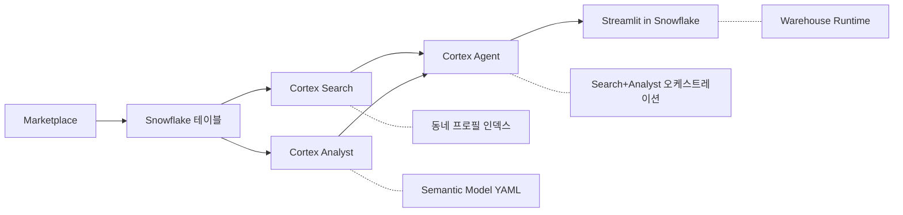

# 동네 MBTI - 프로젝트 기획서

> Snowflake Hackathon 2026 Korea | 2인 팀 | 개발: 4/1~4/12 (11일) | 제출 마감: 4/12
> 접근법: 하이브리드 (Streamlit 3-탭) | Cortex AI 풀스택 활용

## 배경 + 목표

**문제**: 이사를 고민하는 사람이 동네의 '성격'을 직관적으로 이해하고, 자연어로 맞춤 동네를 찾고, 이사 타이밍까지 판단할 수 있는 AI 기반 서비스.

**정량 근거**: 통계청 인구이동통계(2023) 기준 서울 연간 전입 인구 약 62만 명. 부동산 플랫폼 조사에 따르면 이사 결정까지 평균 탐색 기간 4.3개월. 이사 결정의 핵심 고민은 "이 동네가 나와 맞는가"이나, 기존 서비스는 가격·교통 정보만 제공한다.

**기존 서비스와의 차별점**:
- **직방·다방**: 매물 검색 + 가격 정보 중심. 동네의 '분위기·성격' 정보 없음.
- **호갱노노**: 실거래가 시세 분석 특화. 라이프스타일 맞춤 추천 불가.
- **카카오맵**: POI 정보 위주. 데이터 기반 동네 성격 정의 없음.
- **동네 MBTI**: Snowflake Marketplace 4종(상권·부동산·역세권·인구) 크로스 분석 → AI가 동네의 '성격'을 MBTI 16유형으로 정의. 자연어로 "나에게 맞는 동네"를 찾고, ML로 이사 타이밍까지 예측. **기존 서비스가 제공하지 않는 '동네 적합성' 판단을 AI로 처음 구현**.

Snowflake Cortex AI의 다양한 기능(Classify, Sentiment, Complete, Search, Analyst)을 풀스택으로 활용하여 해커톤 심사에서 **기술 깊이 + 시각화 + UX** 모두 어필한다.

---

## 핵심 기능 (3탭)

### 탭 1: 동네 MBTI 카드

- **4축 매핑**: E/I(활동성) / S/N(실용vs문화) / T/F(경제vs생활) / J/P(안정vs변화)
- **Cortex**: AI_CLASSIFY + AI_SENTIMENT + AI_COMPLETE
- **UI**: MBTI 카드형 + 동네 비교 + 궁합 점수

### 탭 2: 자연어 동네 찾기

- Cortex Agent (Search + Analyst) 기반 대화형 UX
- Semantic Model(YAML) 설계 → 자연어→SQL 자동 변환
- 대화 히스토리 지원 (멀티턴)

### 탭 3: 이사 예보

- 실거래가 시계열(리치고 2021~2026) + AI_COMPLETE → 향후 3개월 전망
- "지금 이사하면 좋을까?" 판단 제공 (시세 추이 + 인구이동 + 계절성)
- Cortex Analyst로 사용자 맞춤 질의

---

## 아키텍처

---

## 개발 일정

### 원래 계획 (11일)

| 기간 | 날짜 | 작업 | 상태 |
|------|------|------|------|
| Day 1-3 | 4/1~4/3 | 트라이얼 계정 세팅 + Marketplace 데이터 접근 + 테이블 구성 + EDA | ✅ 계정/데이터 완료 |
| Day 4-6 | 4/4~4/6 | MBTI 4축 로직 + Cortex Agent Semantic Model YAML + Search 인덱스 | ⏳ 미착수 |
| Day 7-9 | 4/7~4/9 | Streamlit UI 3탭 + 카드형 컴포넌트 + 비교 대시보드 | ⏳ 미착수 |
| Day 10-11 | 4/10~4/12 | 통합 테스트 + 데모 시나리오 준비 + 제출 | ⏳ 미착수 |

### 수정 일정 (4/8 기준, 남은 5일)

> 4/8 시점: M1 부분 완료, M2~M4 미착수. 기능 구현 + UI + 제출을 5일 안에 완료해야 함.

| 날짜 | 작업 | 핵심 산출물 |
|------|------|-------------|
| **4/8 (화)** | EDA + 4축 로직 + JOIN 키 매핑 + 테이블 설계 | 동네 마스터 테이블, 4축별 피처 확정 |
| **4/9 (수)** | Cortex AI 파이프라인 (Classify → Complete → Search → Analyst → Agent) | MBTI 분류 결과, Semantic Model YAML, Agent 동작 |
| **4/10 (목)** | Streamlit 3탭 UI (카드 + 대화 + 차트) | 3탭 모두 동작하는 Streamlit 앱 |
| **4/11 (금)** | 통합 테스트 + 버그 수정 + UI 폴리싱 | E2E 통과, 커스텀 CSS 적용 |
| **4/12 (토)** | 데모 영상 촬영 + PPT 작성 + 최종 제출 | 제출물 3종 (영상/PPT/ZIP) 완료 |

**전략**: 기능 깊이보다 6개 Cortex 기능 "모두 동작"을 우선. UI 폴리싱은 Day 11에 집중.

---

## 성공 기준

- MBTI 카드가 데이터 기반으로 설득력 있게 동네 성격을 표현
- 자연어 질의로 3턴 이상 대화하며 동네 추천 가능
- 이사 타이밍 예측이 실거래가 데이터 기반으로 근거 있는 판단 제공
- Cortex AI 6개 기능(Classify/Sentiment/Complete/Search/Analyst/Agent) 모두 활용

---

## 리스크 + 대응

| 리스크 | 대응 | 상태 |
|--------|------|------|
| Marketplace 데이터 접근 실패 | Day 1에 즉시 테스트, 실패 시 공공데이터 CSV 백업 | ✅ 해소 (4종 모두 접근 성공) |
| MBTI 4축 매핑 억지스러움 | EDA 먼저, 클러스터링 결과에 라벨 매핑 (데이터 드리븐) | ⏳ 4/8 착수 |
| Cortex Agent 응답 품질 저조 | Semantic Model 설계에 투자, 샘플 질의 20개 사전 테스트 | ⏳ 미착수 |
| 데이터 정제에 시간 소모 | 4/8 마감 엄수, 4/9부터 반드시 기능 구현 | 🔴 일정 압박 |
| Streamlit UI 임팩트 부족 | 커스텀 CSS + 카드형 컴포넌트 미리 준비 | ⏳ 미착수 |
| **AI_SENTIMENT 텍스트 데이터 부재** | Marketplace 4종에 리뷰/뉴스 없음. **대안**: AI_COMPLETE로 동네 프로필 텍스트 생성 후 AI_SENTIMENT 적용, 또는 공공 뉴스 API 크롤링 | 🔴 신규 리스크 |
| **일정 지연 (4/8 기준 D+7)** | M2~M4를 5일로 압축. 기능 깊이보다 6개 Cortex 기능 "모두 동작" 우선 | 🟡 관리 중 |
| **제출물 준비 부족** | 4/12에 PPT + 데모 영상(10분) + ZIP 제출 필요. 4/11부터 준비 시작 | ⏳ 미착수 |

---

## 기술 제약

- **허용 언어**: Python, Java, Scala (Python 사용)
- **필수**: Snowflake 플랫폼 포함
- **허용**: 오픈소스 라이브러리, API, SDK 활용 가능
- **UI 전략**: Streamlit + `st.components.v1.html()`로 커스텀 HTML/CSS/JS 컴포넌트 삽입
- **가산점**: Snowflake 기능 사용 시 (Cortex AI, Streamlit, Dynamic Tables, Notebooks)

---

## 범위 밖 (OUT)

- 사용자 로그인/개인화
- 실제 부동산 중개 기능
- 모바일 네이티브 앱
- 외부 API 실시간 연동
